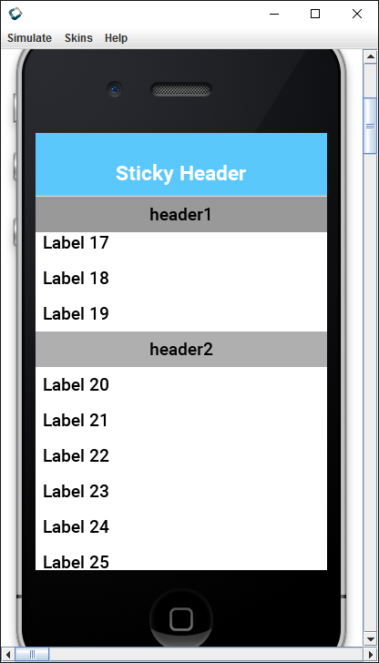

# stickyheaders-codenameone
Sticky Headers for CodenameOne apps

##Usage
Copy the [com.codename1.ui.StickyHeader class](StickyHeader/src/com/codename1/ui/StickyHeader.java) into your project and use it
as a regular Container.
The StickyHeader assumes it is in a scrollable y Conatiner parent.

#####Important - make sure the class stays in the com.codename1.ui package 

```java
        Form hi = new Form("Sticky Header");
        hi.setLayout(new BoxLayout(BoxLayout.Y_AXIS));
        hi.setScrollableY(true);

        for (int j = 0; j < 10; j++) {
            StickyHeader header = new StickyHeader();
            header.setLayout(new BoxLayout(BoxLayout.Y_AXIS));
            header.setUIID("Header");
            Label headerLbl = new Label("header" + j);
            headerLbl.getAllStyles().setAlignment(Component.CENTER);
            header.add(headerLbl);
            hi.addComponent(header);                        
            for (int i = 0; i < 10; i++) {
                hi.addComponent(new Label("Label " + ((j*10) + i)));            
            }
        }
        
        hi.show();
```


Check out this video:

[](http://youtu.be/Hb-Fz-6PG54?hd=1 "Sticky Headers")

